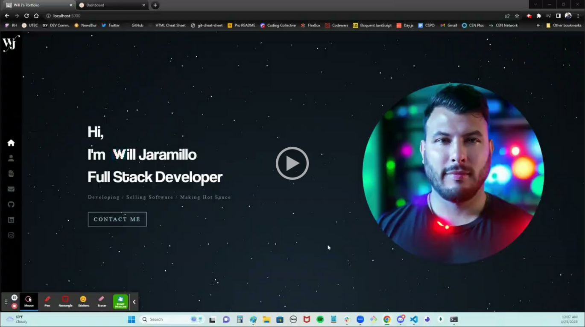

# Will's React Portfolio
  
  
 

  ## Description
 For this project I have created a portfolio using React that includes a Sidebar to navigate Home, About, Portfolio, Contact, and links to GitHub, LinkedIn, and Instagram. You will find my skills on the about page along with my github activity, a few of my recent projects in the portfolio page, and an interactive map of where I live on the contact page. 
  
  ## Table of Contents
  * [Description](#description)
  * [Installation](#installation)
  * [Usage](#usage)
  * [License](#license)
  * [Contribution](#contribution)
  * [Tests](#tests)
  * [Questions](#questions)
  

  ## Installation
  For this application to work, you will need to clone it, run npm install, then npm start.
  
  ## Usage
  With my portfolio you will see me showcase the skill's I have learned during the UT Full Stack coding bootcamp. Feel free to use my portfolio as an example for something you'd like to create. Either follow the installation instructions, watch the demonstration, or click the link to see the now successfully deployed app on heroku.

Demonstration:

 

 Heroku:

 [![https://willj-portfolio.herokuapp.com/]](https://willj-portfolio.herokuapp.com/)

  ## License
  The license this project is under is MIT. For more information, please click the link below:

  https://opensource.org/licenses/MIT
  
  ## Contribution
  Feel free to reach out to me on GitHub.
  
  ## Tests
  Once you've cloned the repo and run npm install, you can then run npm test to validate the methods.
  
  ## Questions
  Any Questions? You can email me at willjaramillo30@gmail.com
  Or, reach out to me on GitHub at https://github/willj30
